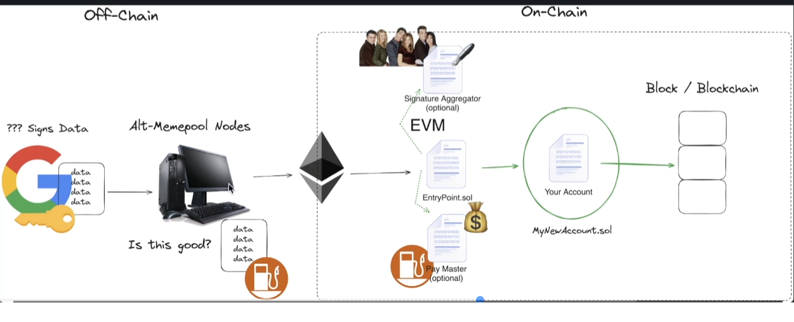

# ERC 4337

https://eips.ethereum.org/EIPS/eip-4337

contract: https://etherscan.io/address/0x0000000071727De22E5E9d8BAf0edAc6f37da032
contract code : https://etherscan.deth.net/address/0x0000000071727De22E5E9d8BAf0edAc6f37da032#writeContract



# Account Abstraction interface

```bash
forge install eth-infinitism/account-abstraction --no-commit
```

zksync

```bash
forge install cyfrin/foundry-era-contracts --no-commit
```
